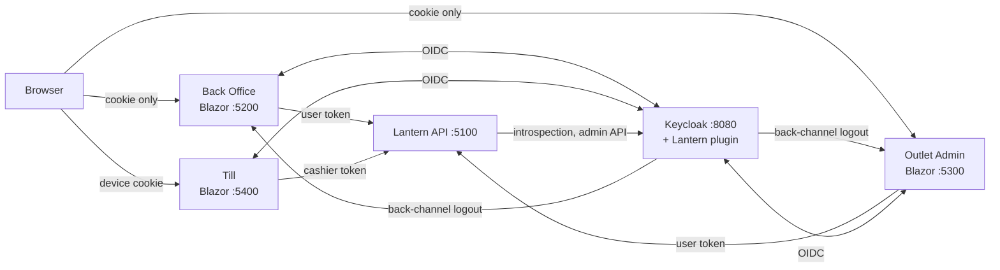

# Lantern Auth

[](https://github.com/irfanfikhri/lantern-auth/actions/workflows/ci.yml)

Staff sign-in for **Lantern Mart**, a fictional retail chain, built on Keycloak: HQ staff, outlet managers, and a
shared till where an outlet account signs in once and cashiers identify themselves with a PIN. It's a learning and
portfolio project; every scenario below runs locally and is covered by tests against a real Keycloak.



## Run it

Requirements: Docker. For the tests: the .NET 10 SDK.

```bash
git clone https://github.com/irfanfikhri/lantern-auth.git && cd lantern-auth
docker compose up -d --build --wait
./scripts/smoke.sh
```

| App | URL | Try signing in as |
|---|---|---|
| Back Office | http://localhost:5200 | `aisha.admin` (sets up MFA), `dina.marketing`, `chloe.staff` |
| Outlet Admin | http://localhost:5300 | `mgr.bangsar` |
| Till | http://localhost:5400 | till `outlet-bangsar-2`, then cashier `c-1001` / PIN `1111` |
| Keycloak admin | http://localhost:8080 | `admin` / `admin` |
| Mailpit (emails) | http://localhost:8025 | — |

Every password is `Lantern!2026`. Everything runs over plain HTTP on `localhost` only; don't expose it.

## Scenarios

| | Scenario | Page |
|---|---|---|
| A | Single sign-on across Back Office and Outlet Admin | [a-sso](docs/scenarios/a-sso.md) |
| B | Single logout, including tabs nobody touches | [b-single-logout](docs/scenarios/b-single-logout.md) |
| C | Roles enforced in the API, with the policy named | [c-roles-in-the-api](docs/scenarios/c-roles-in-the-api.md) |
| D | The till: persistent outlet login, cashier PIN, receipts | [d-till-two-layer-login](docs/scenarios/d-till-two-layer-login.md) |
| E | One till per account, released by a manager | [e-one-till-per-account](docs/scenarios/e-one-till-per-account.md) |
| F | Deactivation locks people out everywhere | [f-deactivation](docs/scenarios/f-deactivation.md) |
| G | MFA for HQ admins only | [g-mfa-for-admins](docs/scenarios/g-mfa-for-admins.md) |
| H | A branded login page per app | [h-branded-login](docs/scenarios/h-branded-login.md) |
| I | Staff, till and cashier management from Back Office | [i-staff-management](docs/scenarios/i-staff-management.md) |

## Demo users

| Username | Can |
|---|---|
| `aisha.admin`, `ben.admin` | Everything in Back Office and Outlet Admin (MFA required) |
| `chloe.staff` | Read-only HQ |
| `dina.marketing` | Promotions |
| `eric.procure`, `farah.finance`, `hana.dual` | Purchase orders: raise, approve, both (never approve your own) |
| `gary.multi` | Marketing and procurement |
| `mgr.bangsar`, `mgr.klcc`, `mgr.pj` | Their own outlet in Outlet Admin |
| `outlet-bangsar-1`, `outlet-bangsar-2`, `outlet-klcc-1`, `outlet-pj-1` | Sign a till in (one till each) |
| `c-1001` 1111, `c-1002` 2222, `c-2001` 3333, `c-2002` 4444 | Cashier PINs (Bangsar, KLCC) |
| `c-3001` 5555 | PJ cashier with a temporary PIN |

## Tests

```bash
dotnet test                                   # plugin-backed integration tests (Testcontainers; Docker needed)
docker compose up -d --build --wait
dotnet test tests/Lantern.BrowserTests        # Playwright against the running stack (HEADED=1 to watch)
./scripts/check-docs.sh
```

## Design

- [Design spec](docs/superpowers/specs/2026-10-01-lantern-auth-design.md) and [plans](docs/superpowers/plans/2026-10-01-roadmap.md)
- Decision records: [BFF](docs/decisions/0001-bff-tokens-stay-server-side.md) ·
  [cashier PIN grant](docs/decisions/0002-direct-grant-for-cashier-pin.md) ·
  [one account per till](docs/decisions/0003-one-account-per-till.md) ·
  [introspection](docs/decisions/0004-introspection-for-deactivation.md) ·
  [outlet mapper](docs/decisions/0005-group-attribute-mapper-for-outlet-id.md) ·
  [offline outlet login](docs/decisions/0006-offline-token-for-the-outlet-login.md) ·
  [PIN lockout](docs/decisions/0007-separate-pin-lockout-counter.md) ·
  [fixed till client id](docs/decisions/0008-fixed-till-client-id.md) ·
  [deny without lockout](docs/decisions/0009-deny-access-without-lockout.md)

## Limits

This is a local demo: plain HTTP, dev secrets in the repo, in-memory sessions in the web apps, and no production
hardening (TLS, high availability, secret management). Known smaller gaps are listed at the end of each plan in
`docs/superpowers/plans/`.
