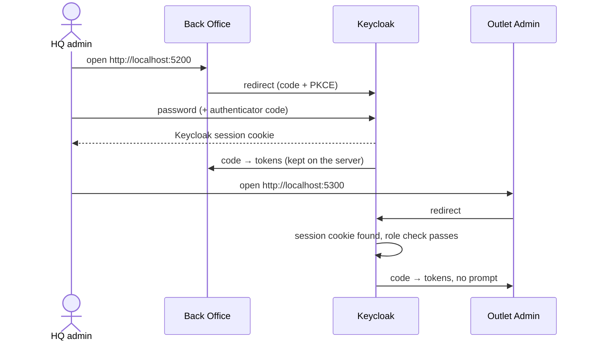

# A. Single sign-on

Sign in to Back Office once; Outlet Admin then opens without asking again.

## Try it

1. Open http://localhost:5200 and sign in as `aisha.admin` / `Lantern!2026` (she'll set up an authenticator app).
2. Open http://localhost:5300 in the same browser: you're straight in.

## How it works

Both apps are confidential OIDC clients that keep tokens on their server ([decision 0001](../decisions/0001-bff-tokens-stay-server-side.md)).
SSO comes from Keycloak's own session cookie. Each app's browser flow checks roles **after** the cookie step,
so SSO never lets someone into an app they don't belong in. Being turned away doesn't count toward the account's
lockout ([decision 0009](../decisions/0009-deny-access-without-lockout.md)).

## Tests

- [SsoAndAccessTests.cs](../../tests/Lantern.IntegrationTests/SsoAndAccessTests.cs): SSO, and SSO not skipping the role check
- [SessionWatcherTests.cs](../../tests/Lantern.BrowserTests/SessionWatcherTests.cs): both apps open in one browser
