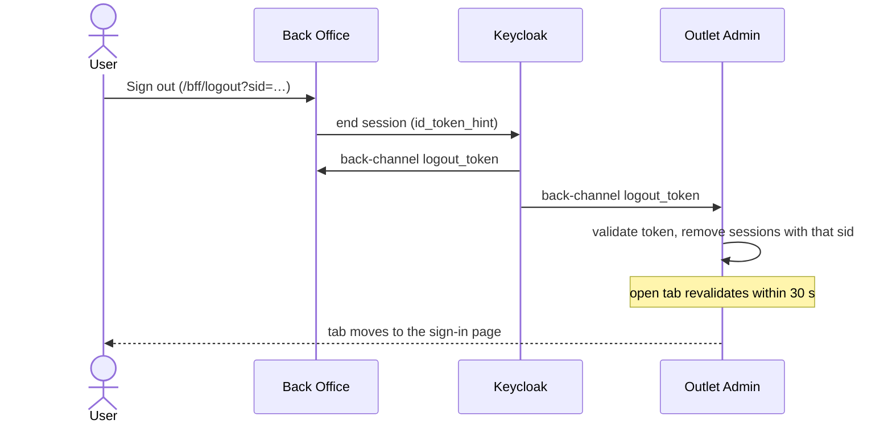

# B. Single logout

Sign out of one app and you're signed out of the other, even in a tab nobody touches.

## Try it

1. Sign in to both apps (see [A](a-sso.md)) and keep the Outlet Admin tab open.
2. Sign out of Back Office. Within about 30 seconds the Outlet Admin tab shows Keycloak's sign-in page.

## How it works

Keycloak POSTs a signed `logout_token` to each app's `/bff/backchannel-logout`. The app checks the signature,
issuer, audience, the logout event and the `sid`, then deletes the matching server sessions. Open tabs re-check
their session every 30 seconds and reload to sign-in when it's gone. The sign-out link carries the session's own
`sid`, so a link on another site can't sign anyone out.

## Tests

- [SingleLogoutTests.cs](../../tests/Lantern.IntegrationTests/SingleLogoutTests.cs): logout everywhere, forged and wrong-audience tokens refused
- [SessionWatcherTests.cs](../../tests/Lantern.BrowserTests/SessionWatcherTests.cs): the untouched tab follows
- [BackOfficeSignInTests.cs](../../tests/Lantern.IntegrationTests/BackOfficeSignInTests.cs): sign-out needs your own `sid`
