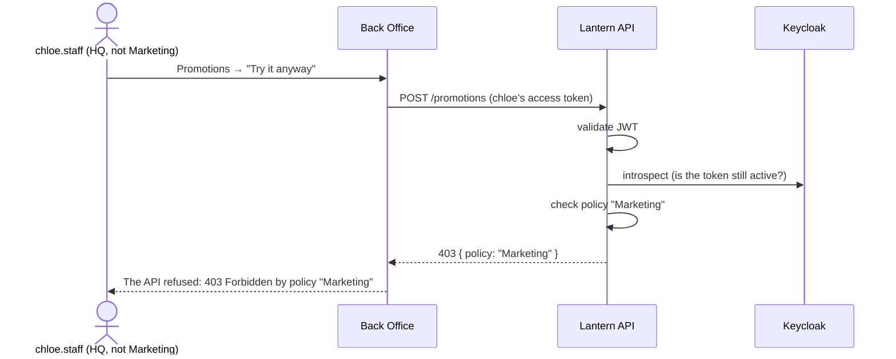

# C. Roles enforced in the API

Screens hide what you can't do, but the API is what refuses it, and it says which rule did.

## Try it

1. Sign in to Back Office as `chloe.staff`, open **Promotions**, press **Try it anyway**.
2. Sign in as `dina.marketing` instead: she gets the create form.

## How it works

The API validates tokens locally and applies named policies: roles, outlet scope (a Bangsar manager can't read
KLCC), and separation of duties (whoever raised a purchase order can't approve it). Every 403 names its policy.

## Tests

- [RolePolicyTests.cs](../../tests/Lantern.IntegrationTests/RolePolicyTests.cs), [PurchaseOrderApprovalTests.cs](../../tests/Lantern.IntegrationTests/PurchaseOrderApprovalTests.cs), [OutletScopeTests.cs](../../tests/Lantern.IntegrationTests/OutletScopeTests.cs)
- [BackOfficeUiTests.cs](../../tests/Lantern.BrowserTests/BackOfficeUiTests.cs): the 403 demo in the browser
