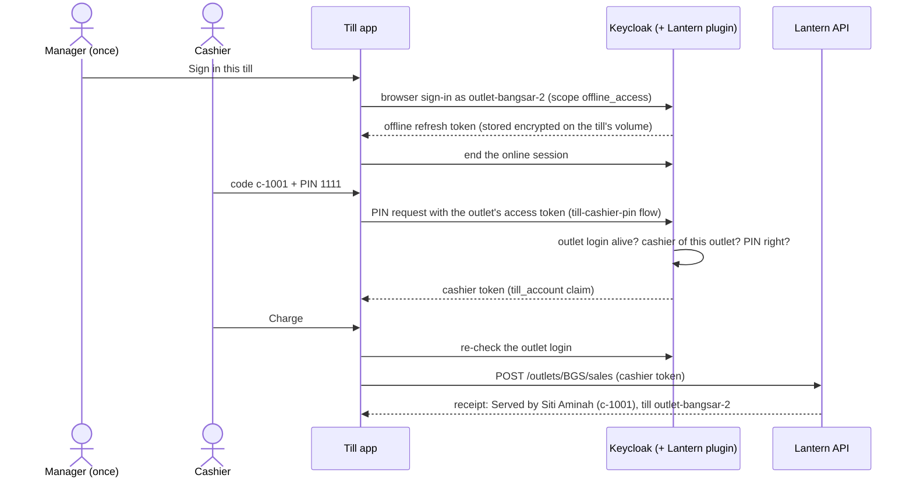

# D. The till's two-layer login

The till is signed in once with its outlet account and stays signed in. Each cashier identifies themselves
with a PIN, and the receipt names them.

## Try it

1. Open http://localhost:5400 → **Sign in this till** as `outlet-bangsar-2` / `Lantern!2026`.
2. Enter `c-1001` / `1111`, tap **House Blend 1kg** twice, **Charge**.
3. For a temporary PIN, press **Sign out this till**, sign it in again as the PJ till `outlet-pj-1`, then enter
   `c-3001` / `5555`: you're asked to choose a new PIN.

## How it works

The outlet login is an offline token, so it survives restarts ([decision 0006](../decisions/0006-offline-token-for-the-outlet-login.md)).
The PIN goes through a dedicated, locked-down direct-grant flow ([decision 0002](../decisions/0002-direct-grant-for-cashier-pin.md)).
Five wrong PINs lock the cashier for 15 minutes on every till, without letting password guesses elsewhere lock
them ([decision 0007](../decisions/0007-separate-pin-lockout-counter.md)). Ten idle minutes return the till to the
PIN pad.

## Tests

- [CashierPinFlowTests.cs](../../tests/Lantern.IntegrationTests/CashierPinFlowTests.cs), [OfflineOutletLoginTests.cs](../../tests/Lantern.IntegrationTests/OfflineOutletLoginTests.cs), [TillSessionTests.cs](../../tests/Lantern.IntegrationTests/TillSessionTests.cs), [TillSaleTests.cs](../../tests/Lantern.IntegrationTests/TillSaleTests.cs)
- [TillRegistrationTests.cs](../../tests/Lantern.IntegrationTests/TillRegistrationTests.cs): the outlet login survives restarting the till
- [TillUiTests.cs](../../tests/Lantern.BrowserTests/TillUiTests.cs): the whole thing in a browser
