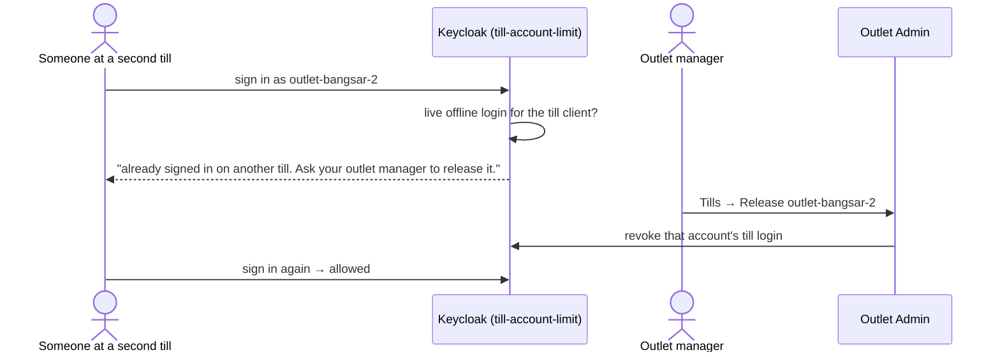

# E. One till per account

A till account can be signed in on only one till at a time. A manager releases it if a till is lost.

## Try it

1. Sign a till in as `outlet-bangsar-2`, then try the same account in a private window: refused.
2. Sign in to Outlet Admin as `mgr.bangsar`, open **Tills**, press **Release**: the private window can now sign in.

## How it works

Adding a till means adding an account. The check is a small plugin step, because Keycloak's own session limiter
ignores offline sessions ([decision 0003](../decisions/0003-one-account-per-till.md)). A released till also loses
its cashier at the next charge.

## Tests

- [TillAccountLimitTests.cs](../../tests/Lantern.IntegrationTests/TillAccountLimitTests.cs), [TillAccountTests.cs](../../tests/Lantern.IntegrationTests/TillAccountTests.cs)
- [TillUiTests.cs](../../tests/Lantern.BrowserTests/TillUiTests.cs), [OutletAdminUiTests.cs](../../tests/Lantern.BrowserTests/OutletAdminUiTests.cs)
