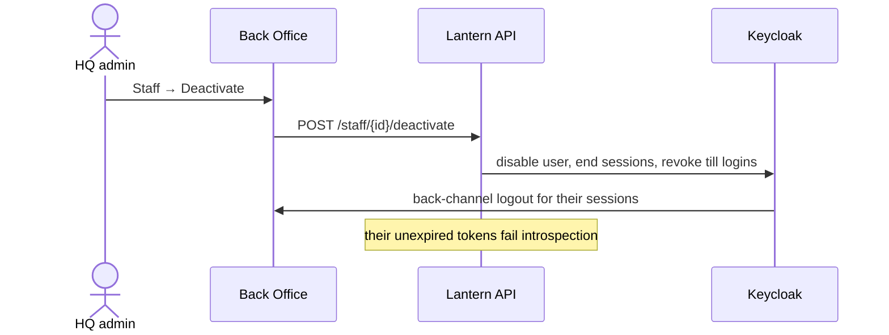

# F. Deactivation

Deactivating someone locks them out of the API at once and signs them out of every open app.

## Try it

1. Sign in to Back Office as `aisha.admin` in one browser and as `dina.marketing` in another.
2. As Aisha, deactivate Dina: within about 30 seconds Dina's tab shows the sign-in page.
3. Reactivate her afterwards with `POST /staff/{id}/reactivate` on the API (there's no button for it yet).

## How it works

The API asks Keycloak whether each token is still active, caching the answer for up to 15 seconds (0 in tests)
([decision 0004](../decisions/0004-introspection-for-deactivation.md)). Till accounts are deactivated the same
way, which also stops their tills.

## Tests

- [DeactivationTests.cs](../../tests/Lantern.IntegrationTests/DeactivationTests.cs), [StaffManagementTests.cs](../../tests/Lantern.IntegrationTests/StaffManagementTests.cs)
- [BackOfficeUiTests.cs](../../tests/Lantern.BrowserTests/BackOfficeUiTests.cs): deactivation reaching an open browser
