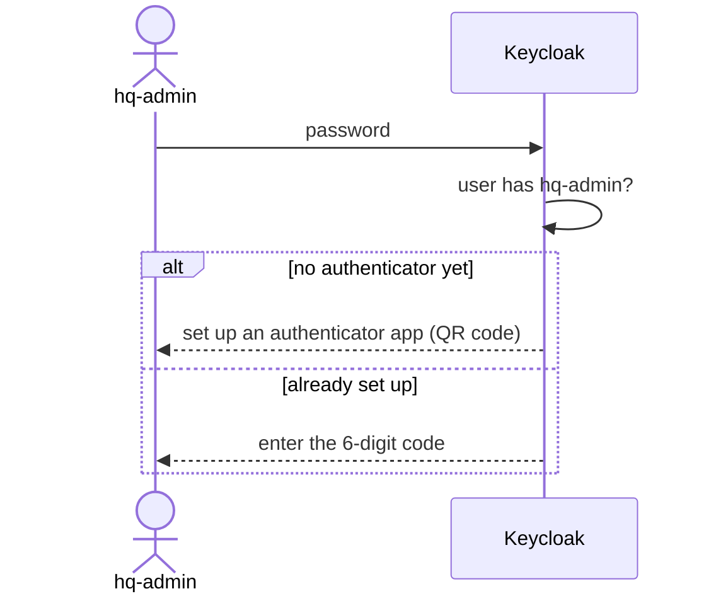

# G. MFA for HQ admins only

HQ admins must use an authenticator app; everyone else signs in with a password.

## Try it

Sign in to Back Office or Outlet Admin as `aisha.admin`: Keycloak asks her to scan a QR code with an authenticator app. `chloe.staff`
is never asked.

## How it works

Every browser flow (the realm default included, so Keycloak's account console can't be used to dodge it) runs a
conditional OTP step for `hq-admin` after the password.

## Tests

- [SsoAndAccessTests.cs](../../tests/Lantern.IntegrationTests/SsoAndAccessTests.cs): enrolment, a fresh code next time, no MFA for staff, no dodging via the account console
- [BackOfficeUiTests.cs](../../tests/Lantern.BrowserTests/BackOfficeUiTests.cs): admins enrol in a real browser
