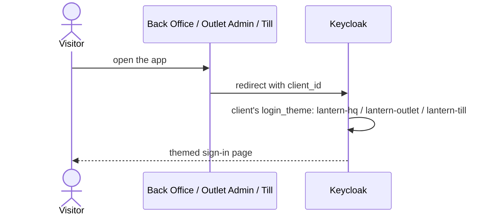

# H. A branded login page per app

Each app's Keycloak pages carry its own look: corporate for HQ, outlet colours for managers, big buttons for the till.

## Try it

Open http://localhost:5200, http://localhost:5300 and http://localhost:5400 (Sign in this till) and compare.

## How it works

Three themes extend Keycloak's default `keycloak.v2` theme with a stylesheet, a page class and a title, so
upgrades don't break them. Deny pages use the same theme.

## Tests

- [LoginThemeTests.cs](../../tests/Lantern.IntegrationTests/LoginThemeTests.cs), [SmokeTests.cs](../../tests/Lantern.BrowserTests/SmokeTests.cs)
