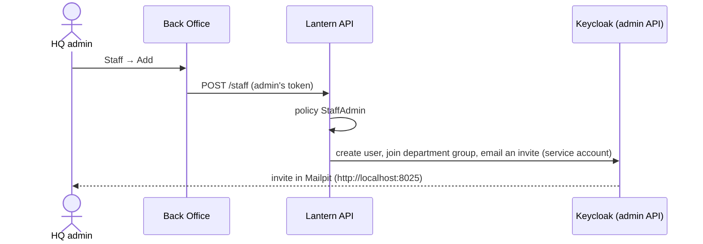

# I. Staff management from Back Office

HQ admins add staff, reset passwords and deactivate people from Back Office, without opening Keycloak. Department
changes, till accounts and cashiers are managed through the same API.

## Try it

1. Sign in to Back Office as `aisha.admin`, open **Staff**, add someone to Procurement.
2. Open Mailpit at http://localhost:8025 to see the invite.

## How it works

Back Office never talks to Keycloak's admin API. The API does, as a narrowly-scoped service account, after its
own `hq-admin` check. Departments are Keycloak groups that grant roles. New till accounts and cashiers get the next
free name (`outlet-pj-2`, `c-3002`), and cashiers start with a temporary PIN.

## Tests

- [StaffManagementTests.cs](../../tests/Lantern.IntegrationTests/StaffManagementTests.cs), [CashierManagementTests.cs](../../tests/Lantern.IntegrationTests/CashierManagementTests.cs), [TillAccountTests.cs](../../tests/Lantern.IntegrationTests/TillAccountTests.cs)
- [BackOfficeUiTests.cs](../../tests/Lantern.BrowserTests/BackOfficeUiTests.cs)
