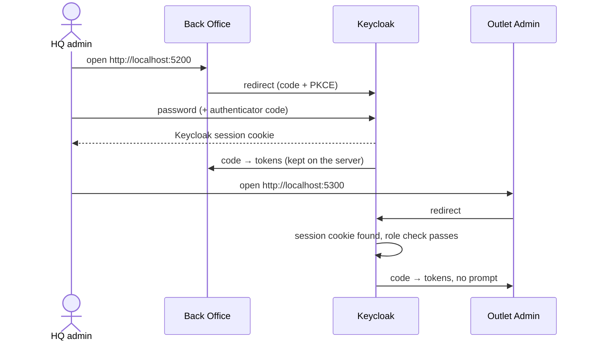
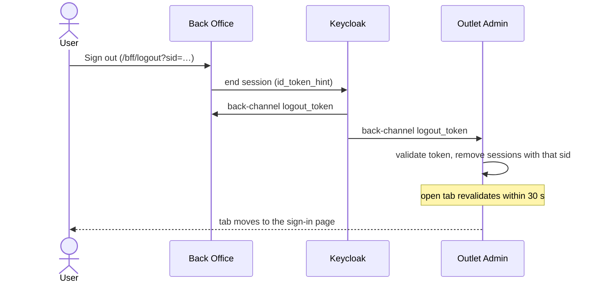
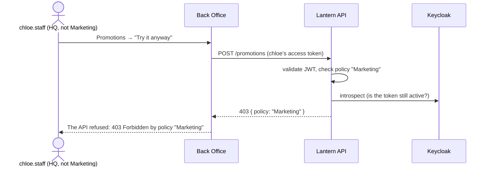
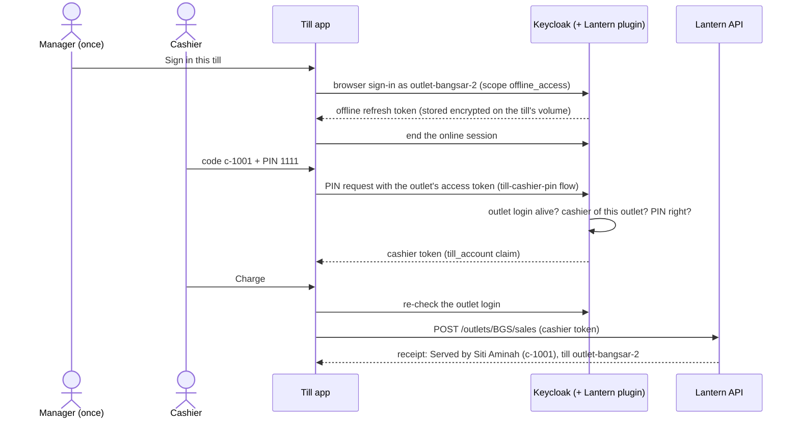
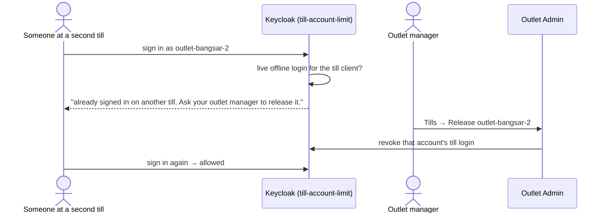
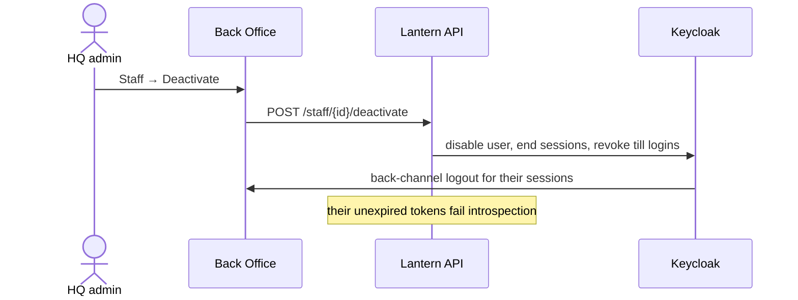
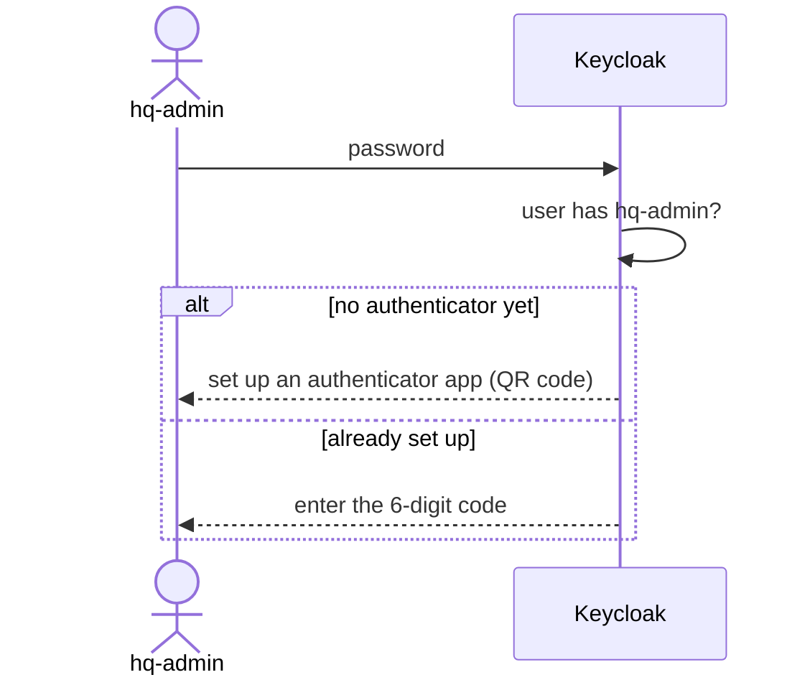
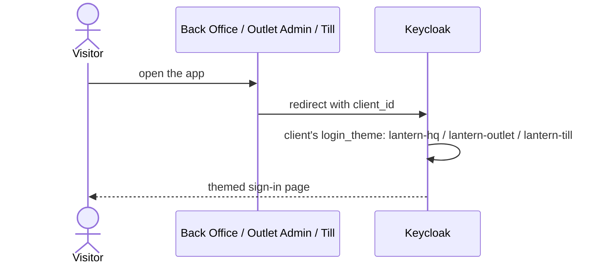
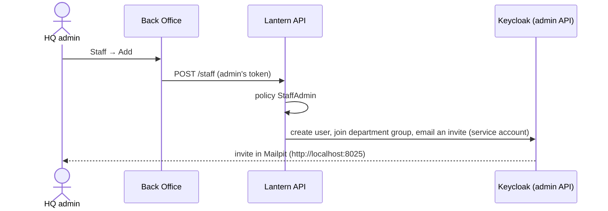
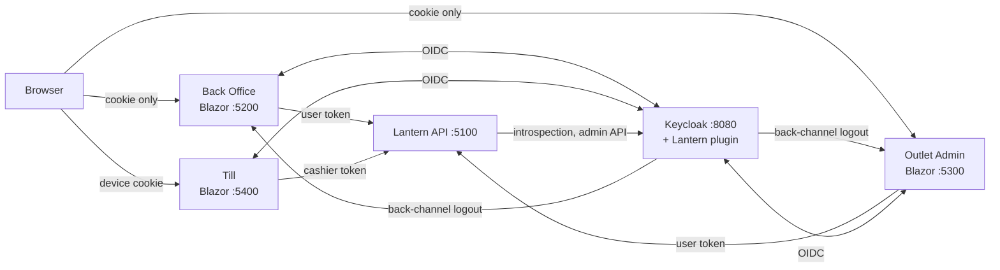

# Lantern Auth — Plan 5: Showcase Implementation Plan

> **For agentic workers:** REQUIRED SUB-SKILL: Use superpowers:subagent-driven-development (recommended) or superpowers:executing-plans to implement this plan task-by-task. Steps use checkbox (`- [ ]`) syntax for tracking.

**Goal:** Make the project something a stranger can read, run and trust. That means:
- real-browser tests of everything a person clicks
- a "signed out elsewhere" watcher, so an open tab notices single logout within 30 s
- GitHub Actions CI
- a README, a page per scenario, and decision records
- a gated step to publish the repo on GitHub

**Architecture:**
- **Browser tests.** A new test project, `Lantern.BrowserTests`, drives Chromium through Playwright for .NET against the running `docker compose` stack. It sets up temporary users, tills and cashiers through Keycloak's admin API. It's kept out of `Lantern.slnx` so a plain `dotnet test` stays fast and needs no stack; CI and the README run it explicitly.
- **Session watcher.** Both web apps get a small interactive `SessionWatcher` component. When revalidation turns the user anonymous, it does a full reload to sign-in.
- **CI.** It runs the plugin unit tests, the integration tests, the stack, the smoke check, the browser tests and a docs check.
- **Docs.** Scenario pages carry Mermaid sequence diagrams, which GitHub renders.

**Tech Stack:** Microsoft.Playwright 1.63.0 (Chromium, headless), xUnit 2.9, GitHub Actions (`actions/checkout@v7`, `actions/setup-dotnet@v6`, `actions/upload-artifact@v7`), and Mermaid in Markdown.

**Spec:** `docs/superpowers/specs/2026-10-01-lantern-auth-design.md`, §5.2 step 4 (30-second revalidation, visible in the browser), §9 (browser row and CI), §10 (README, scenario pages, decision records). Roadmap: `docs/superpowers/plans/2026-10-01-roadmap.md`.

## Global Constraints

- Everything in Plans 1–4's Global Constraints still holds: versions, fictional setting, demo password `Lantern!2026`, conventional commits with **no trailers**, repo-local `user.email` `irfanfikhri@gmail.com`, and `dotnet` via `export DOTNET_ROOT=~/.dotnet PATH=~/.dotnet:$PATH`.
- Branch `irfan/showcase`, created from `irfan/design-spec`.
- **Browser tests run against `docker compose up -d --build --wait`** on `localhost:5200/5300/5400/8080`.
  - If the stack is down, they fail fast with a message saying how to start it. They never silently skip.
  - All browser test classes share one xUnit collection, so they run one at a time against the shared stack.
  - They never change seeded users' credentials. Anything that changes state (MFA enrolment, PIN changes, till registrations, deactivation) uses temporary users created through the admin API.
- **Headless by default.** `HEADED=1` shows the browser. Traces are written to `TestResults/playwright/<test>.zip` for every test, and CI uploads them on failure.
- **Browser install:** `Microsoft.Playwright.Program.Main(["install", "chromium"])` from the fixture, because there's no PowerShell on this Mac. On CI (`CI=true`), it adds `--with-deps`.
- **Publishing is gated.** Task 8 creates a public GitHub repository and pushes to it. The executor must **stop and ask** before running it.

## Review Focus

1. **A tab is left open on Outlet Admin while the user signs out in Back Office.** Within about 30 s that tab leaves the app for the sign-in page, even if nobody touches it. Test in Task 2.
2. **An admin deactivates a staff member who has Back Office open in another browser.** That browser lands on sign-in within about 30 s. Test in Task 3.
3. **An outlet manager releases a till while a cashier is mid-sale.** The till shows its sign-in prompt on the next charge instead of recording the sale. Test in Task 5.
4. **The browser tests are run while the stack is down.** They fail at once with "start the stack" guidance, not after a minute of timeouts per test. Test in Task 1.
5. **A broken relative link or a missing scenario page in the docs.** The docs check fails CI. Test in Task 7.

---

## File Structure

```
src/Lantern.BackOffice/Components/SessionWatcher.razor     # Task 2
src/Lantern.BackOffice/Components/Layout/MainLayout.razor  # Task 2: render the watcher
src/Lantern.OutletAdmin/Components/SessionWatcher.razor    # Task 2
src/Lantern.OutletAdmin/Components/Layout/MainLayout.razor # Task 2
tests/Lantern.BrowserTests/                                # not in Lantern.slnx
  Lantern.BrowserTests.csproj                              # links IntegrationTests' Totp.cs
  StackFixture.cs                                          # stack check, Playwright, browser, admin helper
  KeycloakAdmin.cs                                         # temp users, roles, PINs via Keycloak's admin API
  KeycloakPages.cs                                         # sign in through Keycloak pages (password, TOTP setup, OTP)
  BrowserTest.cs                                           # base: contexts with tracing
  StackCollection.cs
  SmokeTests.cs  SessionWatcherTests.cs  BackOfficeUiTests.cs  TillUiTests.cs  OutletAdminUiTests.cs
.github/workflows/ci.yml                                   # Task 6
scripts/check-docs.sh                                      # Task 7
README.md                                                  # Task 7 (rewrite)
docs/scenarios/a-sso.md … i-staff-management.md            # Task 7
docs/decisions/0001-…0008-….md                             # Task 7
```

---

### Task 1: Browser test project and the first real-browser checks

**Files:**
- Create: `tests/Lantern.BrowserTests/Lantern.BrowserTests.csproj`, `StackFixture.cs`, `KeycloakAdmin.cs`, `KeycloakPages.cs`, `BrowserTest.cs`, `StackCollection.cs`
- Modify: `.gitignore`
- Test: `tests/Lantern.BrowserTests/SmokeTests.cs`

**Interfaces:**
- Consumes: the compose stack (Plans 1–4), and `Totp` from `tests/Lantern.IntegrationTests/Infrastructure/Totp.cs` (Plan 4, linked).
- Produces:
  - `StackFixture` with constants `BackOffice`, `OutletAdmin`, `Till`, `Keycloak`, and properties `Browser`, `Admin`.
  - `KeycloakAdmin`:
    - `CreateUserAsync(string groupPath, params string[] realmRoles)` → `(string Id, string Username)`, password `Lantern!2026`
    - `SetPinAsync(string userId, string pin, bool temporary)`
    - `LogoutUserAsync(string userId)`
  - `KeycloakPages.SignInAsync(IPage page, string username, Totp? totp = null)`. It handles the password form, TOTP setup and the OTP challenge, then waits until Keycloak hands back to the app.
  - `BrowserTest` base with `NewPageAsync()` → `IPage`. Each test's context is traced to `TestResults/playwright/<test>.zip`.
  - `StackCollection.Name = "stack"`.

- [ ] **Step 1: Create the branch and the project**

```bash
cd ~/projects/Personal/DotNet/lantern-auth
git checkout -b irfan/showcase irfan/design-spec
mkdir -p tests/Lantern.BrowserTests
```

`tests/Lantern.BrowserTests/Lantern.BrowserTests.csproj`:
```xml
<Project Sdk="Microsoft.NET.Sdk">
  <PropertyGroup>
    <IsPackable>false</IsPackable>
  </PropertyGroup>
  <ItemGroup>
    <PackageReference Include="Microsoft.NET.Test.Sdk" Version="18.10.1" />
    <PackageReference Include="xunit" Version="2.9.3" />
    <PackageReference Include="xunit.runner.visualstudio" Version="3.1.5" />
    <PackageReference Include="Microsoft.Playwright" Version="1.63.0" />
  </ItemGroup>
  <ItemGroup>
    <Compile Include="..\Lantern.IntegrationTests\Infrastructure\Totp.cs" Link="Totp.cs" />
  </ItemGroup>
  <ItemGroup>
    <Using Include="Xunit" />
  </ItemGroup>
</Project>
```

`.gitignore`: append:
```gitignore
.playwright/
```

- [ ] **Step 2: Write the fixture and helpers**

`tests/Lantern.BrowserTests/StackCollection.cs`:
```csharp
namespace Lantern.BrowserTests;

/// <summary>One collection: browser tests share one stack, so they run one at a time.</summary>
[CollectionDefinition(Name)]
public sealed class StackCollection : ICollectionFixture<StackFixture>
{
    public const string Name = "stack";
}
```

`tests/Lantern.BrowserTests/KeycloakAdmin.cs`:
```csharp
using System.Net.Http.Headers;
using System.Net.Http.Json;
using System.Text.Json.Nodes;

namespace Lantern.BrowserTests;

/// <summary>Sets up temporary users through Keycloak's admin API so tests never change seeded accounts.</summary>
public sealed class KeycloakAdmin(string keycloak) : IDisposable
{
    public const string Password = "Lantern!2026";
    private readonly HttpClient _http = new();

    public async Task<(string Id, string Username)> CreateUserAsync(string groupPath, params string[] realmRoles)
    {
        var username = $"e2e-{Guid.NewGuid():N}"[..16];
        using var admin = await AdminAsync();
        using var create = await admin.PostAsJsonAsync("users", new
        {
            username,
            enabled = true,
            email = $"{username}@lantern.test",
            emailVerified = true,
            firstName = "Test",
            lastName = username,
            groups = new[] { groupPath },
            credentials = new[] { new { type = "password", value = Password, temporary = false } }
        });
        create.EnsureSuccessStatusCode();
        var id = create.Headers.Location!.Segments.Last();
        foreach (var roleName in realmRoles)
        {
            var role = await admin.GetFromJsonAsync<JsonObject>($"roles/{roleName}");
            using var map = await admin.PostAsJsonAsync($"users/{id}/role-mappings/realm", new[] { role });
            map.EnsureSuccessStatusCode();
        }
        return (id, username);
    }

    public async Task SetPinAsync(string userId, string pin, bool temporary)
    {
        using var token = await _http.PostAsync($"{keycloak}/realms/lantern/protocol/openid-connect/token", new FormUrlEncodedContent(
            new Dictionary<string, string>
            {
                ["grant_type"] = "client_credentials",
                ["client_id"] = "api-admin-svc",
                ["client_secret"] = "api-admin-svc-dev-secret"
            }));
        token.EnsureSuccessStatusCode();
        var accessToken = (string)JsonNode.Parse(await token.Content.ReadAsStringAsync())!["access_token"]!;
        using var request = new HttpRequestMessage(HttpMethod.Put, $"{keycloak}/realms/lantern/lantern-pin/users/{userId}")
        {
            Content = JsonContent.Create(new { pin, temporary })
        };
        request.Headers.Authorization = new AuthenticationHeaderValue("Bearer", accessToken);
        using var response = await _http.SendAsync(request);
        response.EnsureSuccessStatusCode();
    }

    public async Task LogoutUserAsync(string userId)
    {
        using var admin = await AdminAsync();
        using var response = await admin.PostAsync($"users/{userId}/logout", null);
        response.EnsureSuccessStatusCode();
    }

    private async Task<HttpClient> AdminAsync()
    {
        using var token = await _http.PostAsync($"{keycloak}/realms/master/protocol/openid-connect/token", new FormUrlEncodedContent(
            new Dictionary<string, string>
            {
                ["grant_type"] = "password", ["client_id"] = "admin-cli", ["username"] = "admin", ["password"] = "admin"
            }));
        token.EnsureSuccessStatusCode();
        var client = new HttpClient { BaseAddress = new Uri($"{keycloak}/admin/realms/lantern/") };
        client.DefaultRequestHeaders.Authorization = new AuthenticationHeaderValue("Bearer",
            (string)JsonNode.Parse(await token.Content.ReadAsStringAsync())!["access_token"]!);
        return client;
    }

    public void Dispose() => _http.Dispose();
}
```

`tests/Lantern.BrowserTests/StackFixture.cs`:
```csharp
using Microsoft.Playwright;

namespace Lantern.BrowserTests;

/// <summary>The running compose stack, one Chromium, and an admin helper for setting up test data.</summary>
public sealed class StackFixture : IAsyncLifetime
{
    public const string BackOffice = "http://localhost:5200";
    public const string OutletAdmin = "http://localhost:5300";
    public const string Till = "http://localhost:5400";
    public const string Keycloak = "http://localhost:8080";

    private IPlaywright? _playwright;

    public IBrowser Browser { get; private set; } = null!;
    public KeycloakAdmin Admin { get; } = new(Keycloak);

    public async Task InitializeAsync()
    {
        await EnsureStackIsUpAsync();

        var install = Environment.GetEnvironmentVariable("CI") == "true"
            ? new[] { "install", "--with-deps", "chromium" }
            : ["install", "chromium"];
        if (Microsoft.Playwright.Program.Main(install) != 0)
            throw new InvalidOperationException("Installing Chromium for Playwright failed.");

        _playwright = await Playwright.CreateAsync();
        Browser = await _playwright.Chromium.LaunchAsync(new BrowserTypeLaunchOptions
        {
            Headless = Environment.GetEnvironmentVariable("HEADED") != "1"
        });
    }

    public static Task EnsureStackIsUpAsync() =>
        EnsureUpAsync([$"{Keycloak}/realms/lantern/.well-known/openid-configuration", $"{Till}/"]);

    /// <summary>Fails in seconds, with the fix, when the stack isn't running (Review Focus 4).</summary>
    public static async Task EnsureUpAsync(IEnumerable<string> urls)
    {
        using var http = new HttpClient { Timeout = TimeSpan.FromSeconds(3) };
        foreach (var url in urls)
        {
            try
            {
                using var response = await http.GetAsync(url);
                response.EnsureSuccessStatusCode();
            }
            catch (Exception e) when (e is HttpRequestException or TaskCanceledException)
            {
                throw new InvalidOperationException(
                    $"The Lantern stack isn't running ({url} did not answer). Start it with: docker compose up -d --build --wait", e);
            }
        }
    }

    public async Task DisposeAsync()
    {
        if (Browser is not null) await Browser.DisposeAsync();
        _playwright?.Dispose();
        Admin.Dispose();
    }
}
```

`tests/Lantern.BrowserTests/BrowserTest.cs`:
```csharp
using System.Runtime.CompilerServices;
using Microsoft.Playwright;

namespace Lantern.BrowserTests;

/// <summary>Gives each test fresh browser contexts (separate cookies, like separate browsers), traced to TestResults.</summary>
public abstract class BrowserTest(StackFixture stack) : IAsyncLifetime
{
    private readonly List<(IBrowserContext Context, string Name)> _contexts = [];

    protected StackFixture Stack { get; } = stack;

    /// <summary>A new page in a new context: a separate browser as far as cookies go.</summary>
    protected async Task<IPage> NewPageAsync([CallerMemberName] string test = "")
    {
        var context = await Stack.Browser.NewContextAsync(new BrowserNewContextOptions { Locale = "en-GB" });
        context.SetDefaultTimeout(15_000);
        await context.Tracing.StartAsync(new TracingStartOptions { Screenshots = true, Snapshots = true });
        _contexts.Add((context, $"{GetType().Name}.{test}.{_contexts.Count}"));
        return await context.NewPageAsync();
    }

    public Task InitializeAsync() => Task.CompletedTask;

    public async Task DisposeAsync()
    {
        foreach (var (context, name) in _contexts)
        {
            await context.Tracing.StopAsync(new TracingStopOptions
            {
                Path = Path.Combine("TestResults", "playwright", $"{name}.zip")
            });
            await context.DisposeAsync();
        }
    }
}
```

`tests/Lantern.BrowserTests/KeycloakPages.cs`:
```csharp
using Lantern.IntegrationTests.Infrastructure;
using Microsoft.Playwright;

namespace Lantern.BrowserTests;

/// <summary>Completes Keycloak's sign-in pages in a real browser, including MFA set-up and challenge.</summary>
public static class KeycloakPages
{
    public static async Task SignInAsync(IPage page, string username, Totp? totp = null, string password = KeycloakAdmin.Password)
    {
        await page.Locator("#username").FillAsync(username);
        await page.Locator("#password").FillAsync(password);
        await page.Locator("#kc-login").ClickAsync();

        var setup = page.Locator("#kc-totp-settings-form");
        var challenge = page.Locator("#kc-otp-login-form");
        var app = page.Locator("[data-testid]");
        var deny = page.Locator(".instruction"); // Keycloak's error and deny pages
        await setup.Or(challenge).Or(app).Or(deny).First.WaitForAsync();

        if (await setup.IsVisibleAsync())
        {
            totp ??= new Totp();
            totp.Secret = await page.Locator("#totpSecret").InputValueAsync();
            await page.Locator("#totp").FillAsync(totp.NextCode());
            await page.Locator("#userLabel").FillAsync("e2e phone");
            await page.Locator("#saveTOTPBtn").ClickAsync();
            await app.Or(deny).First.WaitForAsync();
        }
        else if (await challenge.IsVisibleAsync())
        {
            if (totp?.Secret is null) throw new InvalidOperationException("Keycloak asked for a one-time code but the test has no TOTP secret.");
            await page.Locator("#otp").FillAsync(totp.NextCode());
            await page.Locator("#kc-login").ClickAsync();
            await app.Or(deny).First.WaitForAsync();
        }
    }
}
```

- [ ] **Step 3: Write the failing tests**

`tests/Lantern.BrowserTests/SmokeTests.cs`:
```csharp
using Microsoft.Playwright;
using static Microsoft.Playwright.Assertions;

namespace Lantern.BrowserTests;

[Collection(StackCollection.Name)]
public sealed class SmokeTests(StackFixture stack) : BrowserTest(stack)
{
    [Fact]
    public async Task Back_office_sign_in_shows_the_greeting_from_the_api()
    {
        var page = await NewPageAsync();
        await page.GotoAsync(StackFixture.BackOffice);

        await KeycloakPages.SignInAsync(page, "chloe.staff");

        await Expect(page.GetByTestId("greeting")).ToHaveTextAsync("Hello, Chloe Wong");
    }

    [Fact]
    public async Task Each_app_shows_its_own_login_theme()
    {
        var page = await NewPageAsync();

        await page.GotoAsync(StackFixture.BackOffice);
        await Expect(page.Locator("html")).ToHaveClassAsync(new System.Text.RegularExpressions.Regex("lantern-hq"));
        await page.GotoAsync(StackFixture.OutletAdmin);
        await Expect(page.Locator("html")).ToHaveClassAsync(new System.Text.RegularExpressions.Regex("lantern-outlet"));
    }

    [Fact]
    public async Task Missing_stack_is_reported_quickly_with_how_to_start_it()
    {
        var started = DateTime.UtcNow;

        var error = await Assert.ThrowsAsync<InvalidOperationException>(() => StackFixture.EnsureUpAsync(["http://localhost:5999/"]));

        Assert.Contains("docker compose up -d --build --wait", error.Message);
        Assert.True(DateTime.UtcNow - started < TimeSpan.FromSeconds(5));
    }
}
```

- [ ] **Step 4: Run the tests**

```bash
export DOTNET_ROOT=~/.dotnet PATH=~/.dotnet:$PATH
docker compose up -d --build --wait
dotnet test tests/Lantern.BrowserTests
```
Expected: PASS (3 tests). This task builds test infrastructure only, with no production code, so these checks are expected to pass first time. The first run downloads Chromium, which takes about a minute. To prove the stack check is what fails fast, stop Keycloak and rerun: `docker compose stop keycloak && dotnet test tests/Lantern.BrowserTests` should fail within seconds with the "Start it with: docker compose up -d --build --wait" message. Then run `docker compose up -d --wait` again. If the greeting test times out at Keycloak, run with `HEADED=1` to watch, or open the trace with `npx playwright show-trace TestResults/playwright/<name>.zip`.

- [ ] **Step 5: Commit**

```bash
git add .gitignore tests/Lantern.BrowserTests
git commit -m "test: playwright browser tests against the compose stack"
```

---

### Task 2: An open tab notices single logout within 30 seconds

**Files:**
- Create: `src/Lantern.BackOffice/Components/SessionWatcher.razor`, `src/Lantern.OutletAdmin/Components/SessionWatcher.razor`
- Modify: `src/Lantern.BackOffice/Components/Layout/MainLayout.razor`, `src/Lantern.OutletAdmin/Components/Layout/MainLayout.razor`
- Test: `tests/Lantern.BrowserTests/SessionWatcherTests.cs`

**Interfaces:**
- Consumes:
  - `LanternAuthStateProvider` (Plan 4), which revalidates every 30 s and, when the server session is gone, switches the circuit to anonymous
  - `/bff/login` (Plan 4)
  - `BrowserTest`, `KeycloakPages`, `KeycloakAdmin` (Task 1)
- Produces: `SessionWatcher`, an Interactive Server component rendered in each app's layout for signed-in users. When the auth state turns anonymous, it navigates with `forceLoad: true` to `/bff/login?returnUrl=<current path>`.

- [ ] **Step 1: Write the failing test**

`tests/Lantern.BrowserTests/SessionWatcherTests.cs`:
```csharp
using Lantern.IntegrationTests.Infrastructure;
using Microsoft.Playwright;
using static Microsoft.Playwright.Assertions;

namespace Lantern.BrowserTests;

/// <summary>Spec §5.2 step 4: an open tab shows the sign-in page within ~30 s of signing out elsewhere.</summary>
[Collection(StackCollection.Name)]
public sealed class SessionWatcherTests(StackFixture stack) : BrowserTest(stack)
{
    [Fact]
    public async Task Outlet_admin_tab_leaves_for_sign_in_after_signing_out_of_back_office()
    {
        var (_, admin) = await Stack.Admin.CreateUserAsync("/HQ/Admin");
        var backOffice = await NewPageAsync();
        await backOffice.GotoAsync(StackFixture.BackOffice);
        await KeycloakPages.SignInAsync(backOffice, admin, new Totp());
        var outletAdmin = await backOffice.Context.NewPageAsync(); // same browser, second tab
        await outletAdmin.GotoAsync(StackFixture.OutletAdmin);
        await Expect(outletAdmin.GetByTestId("role-hq-admin")).ToBeVisibleAsync();

        await backOffice.GetByTestId("sign-out").ClickAsync();

        // Nobody touches the Outlet Admin tab: revalidation (30 s) plus the watcher must move it.
        await outletAdmin.WaitForURLAsync(url => url.StartsWith(StackFixture.Keycloak), new() { Timeout = 45_000 });
    }
}
```

- [ ] **Step 2: Run the test and confirm it fails**

Run: `dotnet test tests/Lantern.BrowserTests --filter FullyQualifiedName~SessionWatcherTests`
Expected: FAIL after 45 s with a `TimeoutException` on `WaitForURLAsync`. The circuit turns anonymous, but nothing on the page reacts.

- [ ] **Step 3: Implement the watcher**

`src/Lantern.BackOffice/Components/SessionWatcher.razor`:
```razor
@implements IDisposable
@inject AuthenticationStateProvider AuthState
@inject NavigationManager Navigation

@code {
    // Revalidation (every 30 s) marks the circuit anonymous when the server session is gone, e.g. after a
    // back-channel logout. This turns that into a visible move to the sign-in page (spec §5.2 step 4).
    protected override void OnInitialized() => AuthState.AuthenticationStateChanged += OnChanged;

    private async void OnChanged(Task<AuthenticationState> stateTask)
    {
        var state = await stateTask;
        if (state.User.Identity?.IsAuthenticated == true) return;
        var here = "/" + Navigation.ToBaseRelativePath(Navigation.Uri);
        await InvokeAsync(() => Navigation.NavigateTo($"/bff/login?returnUrl={Uri.EscapeDataString(here)}", forceLoad: true));
    }

    public void Dispose() => AuthState.AuthenticationStateChanged -= OnChanged;
}
```

`src/Lantern.OutletAdmin/Components/SessionWatcher.razor`: identical content.

In **both** `Components/Layout/MainLayout.razor` files, inside `<Authorized>`, after the sign-out link, add:
```razor
            <SessionWatcher @rendermode="InteractiveServer" />
```

- [ ] **Step 4: Rebuild the stack and run the test**

```bash
docker compose up -d --build --wait backoffice outlet-admin
dotnet test tests/Lantern.BrowserTests --filter FullyQualifiedName~SessionWatcherTests
```
Expected: PASS within about 30–40 s.

Then run: `dotnet test` (integration suite)
Expected: all 258 pass. The watcher only adds markup inside `<Authorized>`.

- [ ] **Step 5: Commit**

```bash
git add src/Lantern.BackOffice src/Lantern.OutletAdmin tests/Lantern.BrowserTests
git commit -m "feat: open tabs follow single logout to the sign-in page"
```

---

### Task 3: Back Office in the browser (staff, deactivation, the 403 demo, promotions)

**Files:**
- Test: `tests/Lantern.BrowserTests/BackOfficeUiTests.cs`

**Interfaces:**
- Consumes: Back Office pages and `data-testid`s (Plan 4), the `SessionWatcher` (Task 2), and Task 1 helpers.
- Produces: browser coverage for spec scenarios C, F and I in the UI.

These tests characterise behaviour Plan 4 built but could only test over HTTP. They're expected to pass on the first run. A failure is a real bug: debug it with superpowers:systematic-debugging and fix it in this task, with the failing test as proof.

- [ ] **Step 1: Write the tests**

`tests/Lantern.BrowserTests/BackOfficeUiTests.cs`:
```csharp
using Lantern.IntegrationTests.Infrastructure;
using Microsoft.Playwright;
using static Microsoft.Playwright.Assertions;

namespace Lantern.BrowserTests;

[Collection(StackCollection.Name)]
public sealed class BackOfficeUiTests(StackFixture stack) : BrowserTest(stack)
{
    private async Task<IPage> SignedInAsync(string username, Totp? totp = null)
    {
        var page = await NewPageAsync();
        await page.GotoAsync(StackFixture.BackOffice);
        await KeycloakPages.SignInAsync(page, username, totp);
        return page;
    }

    [Fact]
    public async Task Admin_adds_a_staff_member_who_appears_in_the_list()
    {
        var (_, admin) = await Stack.Admin.CreateUserAsync("/HQ/Admin");
        var page = await SignedInAsync(admin, new Totp());
        await page.GotoAsync($"{StackFixture.BackOffice}/staff");
        var newUser = $"new.{Guid.NewGuid():N}"[..14];

        await page.GetByTestId("new-username").FillAsync(newUser);
        await page.GetByTestId("new-first").FillAsync("Nadia");
        await page.GetByTestId("new-last").FillAsync("Rahim");
        await page.GetByTestId("new-email").FillAsync($"{newUser}@lantern.test");
        await page.GetByTestId("new-department").SelectOptionAsync("Procurement");
        await page.GetByTestId("create-staff-submit").ClickAsync();

        await Expect(page.GetByTestId("staff-message")).ToContainTextAsync($"Added {newUser}");
        await Expect(page.GetByTestId($"staff-{newUser}")).ToContainTextAsync("procurement");
    }

    [Fact]
    public async Task Deactivating_someone_signs_them_out_of_their_open_back_office()
    {
        var (_, admin) = await Stack.Admin.CreateUserAsync("/HQ/Admin");
        var (_, victim) = await Stack.Admin.CreateUserAsync("/HQ/Marketing");
        var victimPage = await SignedInAsync(victim);
        var adminPage = await SignedInAsync(admin, new Totp());
        await adminPage.GotoAsync($"{StackFixture.BackOffice}/staff");

        await adminPage.GetByTestId($"deactivate-{victim}").ClickAsync();

        await Expect(adminPage.GetByTestId($"staff-{victim}")).ToContainTextAsync("Deactivated");
        await victimPage.WaitForURLAsync(url => url.StartsWith(StackFixture.Keycloak), new() { Timeout = 45_000 });
    }

    [Fact]
    public async Task Trying_a_marketing_action_anyway_shows_the_apis_403()
    {
        var page = await SignedInAsync("chloe.staff");
        await page.GotoAsync($"{StackFixture.BackOffice}/promotions");

        await page.GetByTestId("try-anyway").ClickAsync();

        await Expect(page.GetByTestId("promotion-message")).ToContainTextAsync("403 Forbidden by policy \"Marketing\"");
    }

    [Fact]
    public async Task Marketing_creates_a_promotion()
    {
        var page = await SignedInAsync("dina.marketing");
        await page.GotoAsync($"{StackFixture.BackOffice}/promotions");
        var name = $"Flash sale {Guid.NewGuid():N}"[..18];

        await page.GetByTestId("promotion-name").FillAsync(name);
        await page.GetByTestId("promotion-submit").ClickAsync();

        await Expect(page.GetByTestId("promotions")).ToContainTextAsync(name);
    }

    [Fact]
    public async Task Outlet_manager_is_turned_away_by_keycloak()
    {
        var page = await NewPageAsync();
        await page.GotoAsync(StackFixture.BackOffice);

        await KeycloakPages.SignInAsync(page, "mgr.bangsar");

        await Expect(page.GetByText("Your account doesn't have access to Back Office.")).ToBeVisibleAsync();
    }
}
```

- [ ] **Step 2: Run the tests**

Run: `dotnet test tests/Lantern.BrowserTests --filter FullyQualifiedName~BackOfficeUiTests`
Expected: PASS (5 tests). For any failure, open its trace, find the cause, fix the app code, re-run, and record what was wrong in the commit message.

- [ ] **Step 3: Commit**

```bash
git add tests/Lantern.BrowserTests src
git commit -m "test: back office staff, deactivation and 403 demo in the browser"
```

---

### Task 4: The till in the browser (register, PIN, sale, temporary PIN, one account per till)

**Files:**
- Test: `tests/Lantern.BrowserTests/TillUiTests.cs`

**Interfaces:**
- Consumes: Till screens and `data-testid`s (Plan 3), Keycloak's kiosk-themed login (Plan 4), and Task 1 helpers.
- Produces: browser coverage for scenarios D and E.

These are characterisation tests, as in Task 3.

- [ ] **Step 1: Write the tests**

`tests/Lantern.BrowserTests/TillUiTests.cs`:
```csharp
using Microsoft.Playwright;
using static Microsoft.Playwright.Assertions;

namespace Lantern.BrowserTests;

[Collection(StackCollection.Name)]
public sealed class TillUiTests(StackFixture stack) : BrowserTest(stack)
{
    /// <summary>A brand-new till account in Bangsar, signed in on a fresh browser: the till's one-time setup.</summary>
    private async Task<(IPage Page, string Account, string AccountId)> RegisteredTillAsync()
    {
        var (id, account) = await Stack.Admin.CreateUserAsync("/Outlets/Bangsar", "outlet-device");
        var page = await NewPageAsync();
        await page.GotoAsync(StackFixture.Till);
        await page.GetByTestId("register-link").ClickAsync();
        await KeycloakPages.SignInAsync(page, account);
        await Expect(page.GetByTestId("pin-pad")).ToBeVisibleAsync();
        return (page, account, id);
    }

    private static async Task SignInCashierAsync(IPage page, string code, string pin)
    {
        await page.GetByTestId("cashier-code").FillAsync(code);
        await page.GetByTestId("pin").FillAsync(pin);
        await page.GetByTestId("pin-submit").ClickAsync();
    }

    [Fact]
    public async Task Cashier_rings_a_sale_and_the_receipt_names_them_and_the_till()
    {
        var (page, account, _) = await RegisteredTillAsync();

        await SignInCashierAsync(page, "c-1001", "1111");
        await Expect(page.GetByTestId("cashier")).ToHaveTextAsync("Siti Aminah (c-1001)");
        await page.GetByTestId("add-SKU-100").ClickAsync();
        await page.GetByTestId("add-SKU-100").ClickAsync();
        await page.GetByTestId("charge").ClickAsync();

        var receipt = page.GetByTestId("receipt");
        await Expect(receipt).ToContainTextAsync("Served by: Siti Aminah (c-1001)");
        await Expect(receipt).ToContainTextAsync(account);
        await Expect(receipt).ToContainTextAsync("90.00");
    }

    [Fact]
    public async Task Wrong_pin_shows_how_many_tries_are_left()
    {
        var (page, _, _) = await RegisteredTillAsync();
        var (cashierId, cashier) = await Stack.Admin.CreateUserAsync("/Outlets/Bangsar", "cashier");
        await Stack.Admin.SetPinAsync(cashierId, "2468", temporary: false);

        await SignInCashierAsync(page, cashier, "0000");

        await Expect(page.GetByTestId("pin-message")).ToHaveTextAsync("Wrong PIN. 4 tries left.");
    }

    [Fact]
    public async Task Cashier_with_a_temporary_pin_chooses_their_own()
    {
        var (page, _, _) = await RegisteredTillAsync();
        var (cashierId, cashier) = await Stack.Admin.CreateUserAsync("/Outlets/Bangsar", "cashier");
        await Stack.Admin.SetPinAsync(cashierId, "864213", temporary: true);

        await SignInCashierAsync(page, cashier, "864213");
        await Expect(page.GetByTestId("new-pin")).ToBeVisibleAsync();
        await page.GetByTestId("new-pin").FillAsync("2580");
        await page.GetByTestId("pin-submit").ClickAsync();

        await Expect(page.GetByTestId("sale")).ToBeVisibleAsync();
    }

    [Fact]
    public async Task A_second_till_with_the_same_account_is_refused()
    {
        var (_, account, _) = await RegisteredTillAsync();
        var secondTill = await NewPageAsync();
        await secondTill.GotoAsync(StackFixture.Till);
        await secondTill.GetByTestId("register-link").ClickAsync();

        await KeycloakPages.SignInAsync(secondTill, account);

        await Expect(secondTill.GetByText("already signed in on another till")).ToBeVisibleAsync();
    }

    [Fact]
    public async Task Till_stays_signed_in_after_a_reload_and_signs_out_on_request()
    {
        var (page, _, _) = await RegisteredTillAsync();

        await page.ReloadAsync();
        await Expect(page.GetByTestId("pin-pad")).ToBeVisibleAsync();
        await page.GetByTestId("sign-out-till").ClickAsync();

        await Expect(page.GetByTestId("not-registered")).ToBeVisibleAsync();
    }
}
```

- [ ] **Step 2: Run the tests**

Run: `dotnet test tests/Lantern.BrowserTests --filter FullyQualifiedName~TillUiTests`
Expected: PASS (5 tests). Any failure is a real bug: debug it, fix it and re-run, as in Task 3.

- [ ] **Step 3: Commit**

```bash
git add tests/Lantern.BrowserTests src
git commit -m "test: till registration, pin pad, sales and one-account-per-till in the browser"
```

---

### Task 5: Outlet Admin in the browser (stock, releasing a till mid-sale)

**Files:**
- Test: `tests/Lantern.BrowserTests/OutletAdminUiTests.cs`

**Interfaces:**
- Consumes: Outlet Admin pages (Plan 4), Till screens (Plan 3), and Task 1 helpers.
- Produces: browser coverage for the Tills page and Review Focus 3.

These are characterisation tests, as in Task 3.

- [ ] **Step 1: Write the tests**

`tests/Lantern.BrowserTests/OutletAdminUiTests.cs`:
```csharp
using Microsoft.Playwright;
using static Microsoft.Playwright.Assertions;

namespace Lantern.BrowserTests;

[Collection(StackCollection.Name)]
public sealed class OutletAdminUiTests(StackFixture stack) : BrowserTest(stack)
{
    [Fact]
    public async Task Manager_sees_only_their_outlets_stock()
    {
        var page = await NewPageAsync();
        await page.GotoAsync(StackFixture.OutletAdmin);
        await KeycloakPages.SignInAsync(page, "mgr.bangsar");

        await Expect(page.GetByTestId("outlet")).ToHaveTextAsync("BGS");
        await Expect(page.GetByTestId("stock-SKU-100")).ToContainTextAsync("42");
        await page.GotoAsync($"{StackFixture.OutletAdmin}/?outlet=KLC");
        await Expect(page.GetByTestId("outlet")).ToHaveTextAsync("BGS");
    }

    [Fact]
    public async Task Releasing_a_till_stops_it_from_ringing_the_next_sale()
    {
        // A cashier is mid-sale on a till...
        var (_, account) = await Stack.Admin.CreateUserAsync("/Outlets/Bangsar", "outlet-device");
        var till = await NewPageAsync();
        await till.GotoAsync(StackFixture.Till);
        await till.GetByTestId("register-link").ClickAsync();
        await KeycloakPages.SignInAsync(till, account);
        await till.GetByTestId("cashier-code").FillAsync("c-1002");
        await till.GetByTestId("pin").FillAsync("2222");
        await till.GetByTestId("pin-submit").ClickAsync();
        await till.GetByTestId("add-SKU-200").ClickAsync();

        // ...when the manager releases that till account...
        var manager = await NewPageAsync();
        await manager.GotoAsync($"{StackFixture.OutletAdmin}/tills");
        await KeycloakPages.SignInAsync(manager, "mgr.bangsar");
        await manager.GetByTestId($"release-{account}").ClickAsync();
        await Expect(manager.GetByTestId($"till-{account}")).ToContainTextAsync("Not signed in");

        // ...so the charge doesn't go through and the till asks to be signed in again.
        await till.GetByTestId("charge").ClickAsync();
        await Expect(till.GetByTestId("not-registered")).ToBeVisibleAsync();
    }
}
```

- [ ] **Step 2: Run the tests**

Run: `dotnet test tests/Lantern.BrowserTests --filter FullyQualifiedName~OutletAdminUiTests`
Expected: PASS (2 tests).

Then run the whole browser suite: `dotnet test tests/Lantern.BrowserTests`
Expected: PASS (16 tests).

- [ ] **Step 3: Commit**

```bash
git add tests/Lantern.BrowserTests src
git commit -m "test: outlet admin stock and releasing a till mid-sale in the browser"
```

---

### Task 6: GitHub Actions CI

**Files:**
- Create: `.github/workflows/ci.yml`

**Interfaces:**
- Consumes:
  - `keycloak/Dockerfile`'s `plugin` stage (Plan 1), which runs the plugin unit tests during `mvn package`
  - `dotnet test`, `docker compose`, `scripts/smoke.sh`
  - `tests/Lantern.BrowserTests`
  - `scripts/check-docs.sh` (Task 7; the step is added now and passes once Task 7 lands)
- Produces: one workflow that runs on every push and pull request. On failure it uploads `TestResults/` (trx files, Playwright traces) and the compose logs.

- [ ] **Step 1: Write the check first: lint the workflow**

```bash
docker run --rm -v "$PWD":/repo -w /repo rhysd/actionlint:latest -color
```
Expected: FAIL (non-zero exit), because no workflow exists yet. actionlint reports that it found no workflow files.

- [ ] **Step 2: Write the workflow**

`.github/workflows/ci.yml`:
```yaml
name: CI

on:
  push:
  pull_request:

jobs:
  test:
    runs-on: ubuntu-latest
    timeout-minutes: 45
    steps:
      - uses: actions/checkout@v7

      - uses: actions/setup-dotnet@v6
        with:
          dotnet-version: "10.0.x"

      - name: Keycloak extension unit tests
        # The plugin stage runs `mvn package`, which runs the JUnit tests.
        run: docker build --target plugin -t lantern-plugin keycloak

      - name: Integration tests (Keycloak and Mailpit in Testcontainers)
        run: dotnet test --logger "trx;LogFileName=integration.trx" --results-directory TestResults

      - name: Start the stack
        run: docker compose up -d --build --wait

      - name: Smoke check
        run: ./scripts/smoke.sh

      - name: Browser tests (Playwright, against the stack)
        run: dotnet test tests/Lantern.BrowserTests --logger "trx;LogFileName=browser.trx" --results-directory TestResults

      - name: Docs check
        run: ./scripts/check-docs.sh

      - name: Collect compose logs
        if: failure()
        run: mkdir -p TestResults && docker compose logs --no-color > TestResults/compose.log

      - name: Upload test results and Playwright traces
        if: failure()
        uses: actions/upload-artifact@v7
        with:
          name: test-results
          path: |
            TestResults
            tests/Lantern.BrowserTests/TestResults
          retention-days: 7
```

- [ ] **Step 3: Run the check and confirm it passes**

Run: `docker run --rm -v "$PWD":/repo -w /repo rhysd/actionlint:latest -color`
Expected: no output, exit code 0.

Then reproduce CI's steps locally, in order:
```bash
docker build --target plugin -t lantern-plugin keycloak
dotnet test
docker compose up -d --build --wait && ./scripts/smoke.sh
dotnet test tests/Lantern.BrowserTests
```
Expected: every step succeeds (`check-docs.sh` comes in Task 7).

- [ ] **Step 4: Commit**

```bash
git add .github/workflows/ci.yml
git commit -m "ci: unit, integration, smoke and browser tests on every push"
```

---

### Task 7: README, scenario pages and decision records, with a docs check

**Files:**
- Create: `scripts/check-docs.sh`, `docs/scenarios/a-sso.md`, `b-single-logout.md`, `c-roles-in-the-api.md`, `d-till-two-layer-login.md`, `e-one-till-per-account.md`, `f-deactivation.md`, `g-mfa-for-admins.md`, `h-branded-login.md`, `i-staff-management.md`
- Create: `docs/decisions/0001-bff-tokens-stay-server-side.md`, `0002-direct-grant-for-cashier-pin.md`, `0003-one-account-per-till.md`, `0004-introspection-for-deactivation.md`, `0005-group-attribute-mapper-for-outlet-id.md`, `0006-offline-token-for-the-outlet-login.md`, `0007-separate-pin-lockout-counter.md`, `0008-fixed-till-client-id.md`
- Modify: `README.md` (rewrite)

**Interfaces:**
- Consumes: the facts established in Plans 1–5 (ports, users, tests, and the rulings recorded in each plan's ledger).
- Produces:
  - `scripts/check-docs.sh`. It verifies that each scenario page exists with a Mermaid diagram, a `## Try it` and a `## Tests` section; that all eight decision records exist; and that every relative link in the README and `docs/` resolves (except `docs/superpowers/`).

- [ ] **Step 1: Write the docs check**

`scripts/check-docs.sh`:
```bash
#!/usr/bin/env bash
# Scenario pages and decision records exist and are complete; no relative link is broken.
set -euo pipefail
fail() { echo "FAIL: $*" >&2; exit 1; }

for s in a-sso b-single-logout c-roles-in-the-api d-till-two-layer-login e-one-till-per-account \
         f-deactivation g-mfa-for-admins h-branded-login i-staff-management; do
  f="docs/scenarios/$s.md"
  [[ -f "$f" ]] || fail "missing $f"
  grep -q '```mermaid' "$f" || fail "$f has no diagram"
  grep -q '^## Try it' "$f" || fail "$f has no 'Try it' section"
  grep -q '^## Tests' "$f" || fail "$f has no 'Tests' section"
done

for d in 0001 0002 0003 0004 0005 0006 0007 0008; do
  compgen -G "docs/decisions/$d-*.md" > /dev/null || fail "missing decision record $d"
done

python3 - <<'EOF'
import pathlib, re, sys
broken = []
files = [pathlib.Path("README.md"), *pathlib.Path("docs").rglob("*.md")]
for md in files:
    if "superpowers" in md.parts:
        continue
    for target in re.findall(r"\]\(([^)\s#]+)(?:#[^)]*)?\)", md.read_text()):
        if target.startswith(("http://", "https://", "mailto:")):
            continue
        if not (md.parent / target).exists():
            broken.append(f"{md}: {target}")
if broken:
    print("FAIL: broken links:\n  " + "\n  ".join(broken), file=sys.stderr)
    sys.exit(1)
EOF

echo "OK: docs complete"
```

```bash
chmod +x scripts/check-docs.sh
./scripts/check-docs.sh
```
Expected: `FAIL: missing docs/scenarios/a-sso.md`.

- [ ] **Step 2: Write the scenario pages**

`docs/scenarios/a-sso.md`:
````markdown
# A. Single sign-on

Sign in to Back Office once; Outlet Admin then opens without asking again.



## Try it

1. Open http://localhost:5200 and sign in as `aisha.admin` / `Lantern!2026` (she'll set up an authenticator app).
2. Open http://localhost:5300 in the same browser: you're straight in.

## How it works

Both apps are confidential OIDC clients that keep tokens on their server ([decision 0001](../decisions/0001-bff-tokens-stay-server-side.md)).
SSO comes from Keycloak's own session cookie. Each app's browser flow checks roles **after** the cookie step,
so SSO never lets someone into an app they don't belong in.

## Tests

- [SsoAndAccessTests.cs](../../tests/Lantern.IntegrationTests/SsoAndAccessTests.cs): SSO, and SSO not skipping the role check
- [SessionWatcherTests.cs](../../tests/Lantern.BrowserTests/SessionWatcherTests.cs): both apps open in one browser
````

`docs/scenarios/b-single-logout.md`:
````markdown
# B. Single logout

Sign out of one app and you're signed out of the other, even in a tab nobody touches.



## Try it

1. Sign in to both apps (see [A](a-sso.md)) and keep the Outlet Admin tab open.
2. Sign out of Back Office. Within about 30 seconds the Outlet Admin tab shows Keycloak's sign-in page.

## How it works

Keycloak POSTs a signed `logout_token` to each app's `/bff/backchannel-logout`. The app checks the signature,
issuer, audience, the logout event and the `sid`, then deletes the matching server sessions. Open tabs re-check
their session every 30 seconds and reload to sign-in when it's gone. The sign-out link carries the session's own
`sid`, so a link on another site can't sign anyone out.

## Tests

- [SingleLogoutTests.cs](../../tests/Lantern.IntegrationTests/SingleLogoutTests.cs): logout everywhere, forged and wrong-audience tokens refused
- [SessionWatcherTests.cs](../../tests/Lantern.BrowserTests/SessionWatcherTests.cs): the untouched tab follows
- [BackOfficeSignInTests.cs](../../tests/Lantern.IntegrationTests/BackOfficeSignInTests.cs): sign-out needs your own `sid`
````

`docs/scenarios/c-roles-in-the-api.md`:
````markdown
# C. Roles enforced in the API

Screens hide what you can't do, but the API is what refuses it, and it says which rule did.



## Try it

1. Sign in to Back Office as `chloe.staff`, open **Promotions**, press **Try it anyway**.
2. Sign in as `dina.marketing` instead: she gets the create form.

## How it works

The API validates tokens locally and applies named policies: roles, outlet scope (a Bangsar manager can't read
KLCC), and separation of duties (whoever raised a purchase order can't approve it). Every 403 names its policy.

## Tests

- [RolePolicyTests.cs](../../tests/Lantern.IntegrationTests/RolePolicyTests.cs), [PurchaseOrderApprovalTests.cs](../../tests/Lantern.IntegrationTests/PurchaseOrderApprovalTests.cs), [OutletScopeTests.cs](../../tests/Lantern.IntegrationTests/OutletScopeTests.cs)
- [BackOfficeUiTests.cs](../../tests/Lantern.BrowserTests/BackOfficeUiTests.cs): the 403 demo in the browser
````

`docs/scenarios/d-till-two-layer-login.md`:
````markdown
# D. The till's two-layer login

The till is signed in once with its outlet account and stays signed in. Each cashier identifies themselves
with a PIN, and the receipt names them.



## Try it

1. Open http://localhost:5400 → **Sign in this till** as `outlet-bangsar-2` / `Lantern!2026`.
2. Enter `c-1001` / `1111`, add two coffees, **Charge**.
3. Try `c-3001` / `5555` at a PJ till: the PIN is temporary, so you're asked for a new one.

## How it works

The outlet login is an offline token, so it survives restarts ([decision 0006](../decisions/0006-offline-token-for-the-outlet-login.md)).
The PIN goes through a dedicated, locked-down direct-grant flow ([decision 0002](../decisions/0002-direct-grant-for-cashier-pin.md)).
Five wrong PINs lock the cashier for 15 minutes on every till, without letting password guesses elsewhere lock
them ([decision 0007](../decisions/0007-separate-pin-lockout-counter.md)). Ten idle minutes return the till to the
PIN pad.

## Tests

- [CashierPinFlowTests.cs](../../tests/Lantern.IntegrationTests/CashierPinFlowTests.cs), [OfflineOutletLoginTests.cs](../../tests/Lantern.IntegrationTests/OfflineOutletLoginTests.cs), [TillSessionTests.cs](../../tests/Lantern.IntegrationTests/TillSessionTests.cs), [TillSaleTests.cs](../../tests/Lantern.IntegrationTests/TillSaleTests.cs)
- [TillUiTests.cs](../../tests/Lantern.BrowserTests/TillUiTests.cs): the whole thing in a browser
````

`docs/scenarios/e-one-till-per-account.md`:
````markdown
# E. One till per account

A till account can be signed in on only one till at a time. A manager releases it if a till is lost.



## Try it

1. Sign a till in as `outlet-bangsar-2`, then try the same account in a private window: refused.
2. Sign in to Outlet Admin as `mgr.bangsar`, open **Tills**, press **Release**: the private window can now sign in.

## How it works

Adding a till means adding an account. The check is a small plugin step, because Keycloak's own session limiter
ignores offline sessions ([decision 0003](../decisions/0003-one-account-per-till.md)). A released till also loses
its cashier at the next charge.

## Tests

- [TillAccountLimitTests.cs](../../tests/Lantern.IntegrationTests/TillAccountLimitTests.cs), [TillAccountTests.cs](../../tests/Lantern.IntegrationTests/TillAccountTests.cs)
- [TillUiTests.cs](../../tests/Lantern.BrowserTests/TillUiTests.cs), [OutletAdminUiTests.cs](../../tests/Lantern.BrowserTests/OutletAdminUiTests.cs)
````

`docs/scenarios/f-deactivation.md`:
````markdown
# F. Deactivation

Deactivating someone locks them out of the API at once and signs them out of every open app.



## Try it

1. Sign in to Back Office as `aisha.admin` in one browser and as `dina.marketing` in another.
2. As Aisha, deactivate Dina: within about 30 seconds Dina's tab shows the sign-in page.
3. Reactivate her afterwards with `POST /staff/{id}/reactivate` on the API (there's no button for it yet).

## How it works

The API asks Keycloak whether each token is still active, caching the answer for up to 15 seconds (0 in tests)
([decision 0004](../decisions/0004-introspection-for-deactivation.md)). Till accounts are deactivated the same
way, which also stops their tills.

## Tests

- [DeactivationTests.cs](../../tests/Lantern.IntegrationTests/DeactivationTests.cs), [StaffManagementTests.cs](../../tests/Lantern.IntegrationTests/StaffManagementTests.cs)
- [BackOfficeUiTests.cs](../../tests/Lantern.BrowserTests/BackOfficeUiTests.cs): deactivation reaching an open browser
````

`docs/scenarios/g-mfa-for-admins.md`:
````markdown
# G. MFA for HQ admins only

HQ admins must use an authenticator app; everyone else signs in with a password.



## Try it

Sign in anywhere as `aisha.admin`: Keycloak asks her to scan a QR code with an authenticator app. `chloe.staff`
is never asked.

## How it works

Every browser flow (the realm default included, so Keycloak's account console can't be used to dodge it) runs a
conditional OTP step for `hq-admin` after the password.

## Tests

- [SsoAndAccessTests.cs](../../tests/Lantern.IntegrationTests/SsoAndAccessTests.cs): enrolment, a fresh code next time, no MFA for staff, no dodging via the account console
- [BackOfficeUiTests.cs](../../tests/Lantern.BrowserTests/BackOfficeUiTests.cs): admins enrol in a real browser
````

`docs/scenarios/h-branded-login.md`:
````markdown
# H. A branded login page per app

Each app's Keycloak pages carry its own look: corporate for HQ, outlet colours for managers, big buttons for the till.



## Try it

Open http://localhost:5200, http://localhost:5300 and http://localhost:5400 (Sign in this till) and compare.

## How it works

Three themes extend Keycloak's default `keycloak.v2` theme with a stylesheet, a page class and a title, so
upgrades don't break them. Deny pages use the same theme.

## Tests

- [LoginThemeTests.cs](../../tests/Lantern.IntegrationTests/LoginThemeTests.cs), [SmokeTests.cs](../../tests/Lantern.BrowserTests/SmokeTests.cs)
````

`docs/scenarios/i-staff-management.md`:
````markdown
# I. Staff management from Back Office

HQ admins add staff, reset passwords and deactivate people from Back Office, without opening Keycloak. Department
changes, till accounts and cashiers are managed through the same API.



## Try it

1. Sign in to Back Office as `aisha.admin`, open **Staff**, add someone to Procurement.
2. Open Mailpit at http://localhost:8025 to see the invite.

## How it works

Back Office never talks to Keycloak's admin API. The API does, as a narrowly-scoped service account, after its
own `hq-admin` check. Departments are Keycloak groups that grant roles. New till accounts and cashiers get the next
free name (`outlet-pj-2`, `c-3002`), and cashiers start with a temporary PIN.

## Tests

- [StaffManagementTests.cs](../../tests/Lantern.IntegrationTests/StaffManagementTests.cs), [CashierManagementTests.cs](../../tests/Lantern.IntegrationTests/CashierManagementTests.cs)
- [BackOfficeUiTests.cs](../../tests/Lantern.BrowserTests/BackOfficeUiTests.cs)
````

- [ ] **Step 3: Write the decision records**

`docs/decisions/0001-bff-tokens-stay-server-side.md`:
```markdown
# 0001. Tokens stay on the server (backend-for-frontend)

**Status:** Accepted

**Context.** Browser-held tokens can be stolen by any script that runs on the page.

**Decision.** All three web apps are confidential OIDC clients that keep tokens in a server-side session. The
browser holds only an HttpOnly cookie pointing at it. Sessions are indexed by Keycloak's `sid`, so back-channel
logout can find them.

**Consequences.** Tokens never reach the browser. Sessions live in memory, so restarting an app signs its users
out (a demo limit; production would use a shared store). The till's server is the only holder of its client
secret, which is what makes the PIN flow ([0002](0002-direct-grant-for-cashier-pin.md)) safe.
```

`docs/decisions/0002-direct-grant-for-cashier-pin.md`:
```markdown
# 0002. A locked-down direct grant for the cashier PIN

**Status:** Accepted

**Context.** Cashiers switch every few minutes. A full-page redirect per switch is slow at a till, and an
API-side PIN check would keep cashiers outside Keycloak.

**Options considered.** A PIN step on Keycloak's sign-in page (by the book, but a redirect per switch); a PIN
checked by the API (no Java, but cashiers outside Keycloak); a dedicated direct-grant flow (chosen).

**Decision.** The `till` client's only direct-grant flow is `till-cashier-pin`, built from three plugin steps. The
request must carry a live outlet login, the code must name a cashier of the same outlet, and the PIN must match.
It never accepts a password.

**Consequences.** OAuth 2.1 discourages the password grant; here it is confidential, server-only, single-client,
and useless without an outlet login. Cashiers are real Keycloak users, so deactivation, roles and audit work for
them.
```

`docs/decisions/0003-one-account-per-till.md`:
```markdown
# 0003. One account per till, refuse rather than take over

**Status:** Accepted

**Context.** A till account must not be signed in on two tills. Keycloak's built-in session limiter only counts
online sessions, and the till's login is an offline one.

**Decision.** A plugin step refuses an outlet sign-in while the account has a live offline login for the till
client. It refuses rather than taking over, because silently taking over would strand a till mid-sale and let
anyone with the password move a till without a manager noticing. Managers release accounts from Outlet Admin.

**Consequences.** A lost or wiped till needs a manager's release. Adding a counter means adding an account.
```

`docs/decisions/0004-introspection-for-deactivation.md`:
```markdown
# 0004. Introspection with a short cache for deactivation

**Status:** Accepted

**Context.** Access tokens live 5 minutes. Deactivated staff shouldn't keep access for that long.

**Decision.** After local JWT validation, the API asks Keycloak whether the token is still active, caching
"active" for 15 seconds (configurable, 0 in tests) and "inactive" until the token expires. If Keycloak can't
answer, the request is refused.

**Consequences.** Lockout within the cache window, at the cost of one extra call per uncached request. Fails
closed during a Keycloak outage.
```

`docs/decisions/0005-group-attribute-mapper-for-outlet-id.md`:
```markdown
# 0005. A small mapper copies the outlet from the group into tokens

**Status:** Accepted

**Context.** Outlets are Keycloak groups with an `outlet_id` attribute. Keycloak has no built-in mapper for group
attributes, and copying the value onto each user would let the two drift apart.

**Decision.** The plugin includes `lantern-outlet-id-mapper`, which emits `outlet_id` from the user's outlet
group.

**Consequences.** Moving someone between outlets is one group change. A user in two outlet groups would get the
first one found; the data model doesn't allow that.
```

`docs/decisions/0006-offline-token-for-the-outlet-login.md`:
```markdown
# 0006. An offline token for the till's outlet login

**Status:** Accepted

**Context.** A till is signed in once and must stay signed in across browser, server and Keycloak restarts.

**Decision.** The till requests `offline_access`, stores the offline refresh token encrypted (ASP.NET Core Data
Protection) in SQLite on its volume, keyed by a random id in a long-lived HttpOnly cookie, and ends the online
session straight away. Imported outlet accounts get `offline_access` through the `outlet-device` role.

**Consequences.** Releasing or deactivating a till revokes the offline login. A Keycloak error other than a
rejected login never unregisters a till.
```

`docs/decisions/0007-separate-pin-lockout-counter.md`:
```markdown
# 0007. Wrong PINs have their own lockout counter

**Status:** Accepted (revised during Plan 2's review)

**Context.** Keycloak's brute-force counter is per user and shared by every login page. With it, anyone could
lock a cashier out of the till by typing wrong passwords for their code on any Keycloak page, and a right PIN
didn't reset the count.

**Decision.** The PIN step keeps its own counter in Keycloak's single-use store, using the realm's settings: five
wrong PINs lock for 15 minutes after the last one, a right PIN clears it, and an admin PIN reset lifts it.

**Consequences.** PIN lockout is independent of password lockout.
```

`docs/decisions/0008-fixed-till-client-id.md`:
```markdown
# 0008. A fixed id for the till client instead of client-read rights

**Status:** Accepted

**Context.** Listing a till account's offline sessions needs the till client's internal id. Finding it at run
time would need `view-clients`, which also exposes client secrets.

**Decision.** The realm file gives the till client a fixed id, and the API reads it from configuration.

**Consequences.** The API's service account stays least-privileged. Re-creating the till client by hand would
change the id, and the setting would have to follow.
```

- [ ] **Step 4: Rewrite the README**

`README.md` (replace the whole file):
````markdown
# Lantern Auth

[](https://github.com/irfanfikhri/lantern-auth/actions/workflows/ci.yml)

Staff sign-in for **Lantern Mart**, a fictional retail chain, built on Keycloak: HQ staff, outlet managers, and a
shared till where an outlet account signs in once and cashiers identify themselves with a PIN. It's a learning and
portfolio project; every scenario below runs locally and is covered by tests against a real Keycloak.



## Run it

Requirements: Docker. For the tests: the .NET 10 SDK.

```bash
git clone https://github.com/irfanfikhri/lantern-auth.git && cd lantern-auth
docker compose up -d --build --wait
./scripts/smoke.sh
```

| App | URL | Try signing in as |
|---|---|---|
| Back Office | http://localhost:5200 | `aisha.admin` (sets up MFA), `dina.marketing`, `chloe.staff` |
| Outlet Admin | http://localhost:5300 | `mgr.bangsar` |
| Till | http://localhost:5400 | till `outlet-bangsar-2`, then cashier `c-1001` / PIN `1111` |
| Keycloak admin | http://localhost:8080 | `admin` / `admin` |
| Mailpit (emails) | http://localhost:8025 | — |

Every password is `Lantern!2026`. Everything runs over plain HTTP on `localhost` only; don't expose it.

## Scenarios

| | Scenario | Page |
|---|---|---|
| A | Single sign-on across Back Office and Outlet Admin | [a-sso](docs/scenarios/a-sso.md) |
| B | Single logout, including tabs nobody touches | [b-single-logout](docs/scenarios/b-single-logout.md) |
| C | Roles enforced in the API, with the policy named | [c-roles-in-the-api](docs/scenarios/c-roles-in-the-api.md) |
| D | The till: persistent outlet login, cashier PIN, receipts | [d-till-two-layer-login](docs/scenarios/d-till-two-layer-login.md) |
| E | One till per account, released by a manager | [e-one-till-per-account](docs/scenarios/e-one-till-per-account.md) |
| F | Deactivation locks people out everywhere | [f-deactivation](docs/scenarios/f-deactivation.md) |
| G | MFA for HQ admins only | [g-mfa-for-admins](docs/scenarios/g-mfa-for-admins.md) |
| H | A branded login page per app | [h-branded-login](docs/scenarios/h-branded-login.md) |
| I | Staff, till and cashier management from Back Office | [i-staff-management](docs/scenarios/i-staff-management.md) |

## Demo users

| Username | Can |
|---|---|
| `aisha.admin`, `ben.admin` | Everything in Back Office and Outlet Admin (MFA required) |
| `chloe.staff` | Read-only HQ |
| `dina.marketing` | Promotions |
| `eric.procure`, `farah.finance`, `hana.dual` | Purchase orders: raise, approve, both (never approve your own) |
| `gary.multi` | Marketing and procurement |
| `mgr.bangsar`, `mgr.klcc`, `mgr.pj` | Their own outlet in Outlet Admin |
| `outlet-bangsar-1`, `outlet-bangsar-2`, `outlet-klcc-1`, `outlet-pj-1` | Sign a till in (one till each) |
| `c-1001` 1111, `c-1002` 2222, `c-2001` 3333, `c-2002` 4444 | Cashier PINs (Bangsar, KLCC) |
| `c-3001` 5555 | PJ cashier with a temporary PIN |

## Tests

```bash
dotnet test                                   # plugin-backed integration tests (Testcontainers; Docker needed)
docker compose up -d --build --wait
dotnet test tests/Lantern.BrowserTests        # Playwright against the running stack (HEADED=1 to watch)
./scripts/check-docs.sh
```

## Design

- [Design spec](docs/superpowers/specs/2026-10-01-lantern-auth-design.md) and [plans](docs/superpowers/plans/2026-10-01-roadmap.md)
- Decision records: [BFF](docs/decisions/0001-bff-tokens-stay-server-side.md) ·
  [cashier PIN grant](docs/decisions/0002-direct-grant-for-cashier-pin.md) ·
  [one account per till](docs/decisions/0003-one-account-per-till.md) ·
  [introspection](docs/decisions/0004-introspection-for-deactivation.md) ·
  [outlet mapper](docs/decisions/0005-group-attribute-mapper-for-outlet-id.md) ·
  [offline outlet login](docs/decisions/0006-offline-token-for-the-outlet-login.md) ·
  [PIN lockout](docs/decisions/0007-separate-pin-lockout-counter.md) ·
  [fixed till client id](docs/decisions/0008-fixed-till-client-id.md)

## Limits

This is a local demo: plain HTTP, dev secrets in the repo, in-memory sessions in the web apps, and no production
hardening (TLS, high availability, secret management). Known smaller gaps are listed at the end of each plan in
`docs/superpowers/plans/`.
````

- [ ] **Step 5: Run the docs check and confirm it passes**

Run: `./scripts/check-docs.sh`
Expected: `OK: docs complete`. If a link is reported broken, fix the path in the page; test files named in the pages must exist at those paths.

- [ ] **Step 6: Commit**

```bash
git add scripts/check-docs.sh README.md docs/scenarios docs/decisions
git commit -m "docs: readme, scenario walkthroughs and decision records"
```

---

### Task 8: Publish to GitHub (STOP — ask before running)

**This task is outward-facing and must not run without the user's explicit go-ahead.** It creates a public
repository under their account and pushes to it. The executor stops here, shows the user the commands, and waits.

**Files:** none. It's git remote setup only.

- [ ] **Step 1: Ask the user**

Show them:
- **Where it goes:** the repository name and visibility (`irfanfikhri/lantern-auth`, public).
- **Branches:** `main` is created at the current commit, without a new commit, and both `main` and `irfan/design-spec` are pushed.
- **README badge:** the badge URL assumes the GitHub user `irfanfikhri`. If their GitHub username differs, update the badge and clone URL in `README.md` first.

Then wait for a yes.

- [ ] **Step 2: Publish (only after a yes)**

```bash
gh auth status
git branch main
gh repo create lantern-auth --public --source . --remote origin --description "Staff sign-in for a fictional retail chain on Keycloak: SSO, single logout, MFA, and a PIN-based shared till"
git push -u origin main irfan/design-spec
```
Expected: the repo exists and the CI workflow starts on `main`.

- [ ] **Step 3: Watch CI**

```bash
gh run watch --exit-status
```
Expected: the run succeeds. If it fails, download the `test-results` artifact (`gh run download`), fix the cause on a branch, and push again.
````
